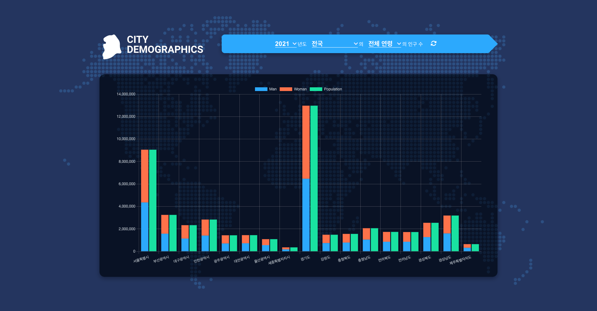

# city-demographics

> 도시별 인구 통계 웹 사이트입니다.

년도 선택 시, bar차트 형태로 도시별 전체 인구 및 성별 수를 확인할 수 있고  
도시 선택 시, bar차트 형태로 해당 도시의 연령별 인구 수를 확인할 수 있고  
연령 선택 시, doughnut차트 형태로 총 인구 수 대비 해당 연령의 비율 확인이 가능합니다.

### demo

[https://sorate7624.github.io/city-demographics/](https://sorate7624.github.io/city-demographics/)



## 설치 방법

아래 단계를 따라 프로젝트를 설치하세요.

1. 프로젝트를 클론합니다.

   ```bash
   git clone https://github.com/sorate7624/city-demographics.git
   ```

2. 프로젝트 디렉토리로 이동합니다.

   ```bash
   cd city-demographics
   ```

3. 종속성을 설치합니다.

   ```bash
   npm install
   ```

4. 프로젝트를 실행합니다.
   ```bash
   npm run dev
   ```

## 기술 스택

프로젝트의 기술 스택은 다음과 같습니다.

### Development

<div style="display: flex">
  
  
  
  
  
  <br/>
  
  
</div>

### Environment

<div style="display: flex">
  
  
  
</div>

### Config

<div style="display: flex">
  
  
</div>

## 폴더 구조

프로젝트의 주요 폴더 구조는 다음과 같습니다.

- `dist/`: 정적 파일들을 담고 있는 폴더입니다. `index.html` 파일이 여기에 위치합니다.
- `public/`: 정적 파일들을 담고 있는 폴더입니다.
- `src/`: 프로젝트의 소스 코드를 담고 있는 폴더입니다. `main.jsx` 파일이 여기에 위치합니다.
  - `components/`: 프로젝트에서 사용되는 컴포넌트 파일들을 담고 있는 폴더입니다.
  - `styles/`: 프로젝트에서 사용되는 styles 관련 파일들을 담고 있는 폴더입니다.
- `vite.config.js`: vite 설정 파일입니다.

## 업데이트 내역

- 0.1.0
  - select 색상 수정 및 화살표 아이콘 추가
- 0.0.8
  - 로고 이미지 색상 변경
- 0.0.7
  - pie차트에서 doughnut차트로 변경 및 반응형 UI 적용
- 0.0.6
  - select 선택 시, 차트 변경 기능 추가 및 파일 분리
- 0.0.5
  - 토큰 설정 및 차트 기본 UI 추가
- 0.0.4
  - 필터, 차트 기본 설정
- 0.0.3
  - vite 설정 파일 수정
- 0.0.2
  - 경로 수정
- 0.0.1
  - 첫 출시

## 정보

최혜진 – sorate_@naver.com

[https://github.com/sorate7624/](https://github.com/sorate7624/)

## 기여 방법

1. (<https://github.com/sorate7624/city-demographics/fork>)을 포크합니다.
2. (`git checkout -b feature/fooBar`) 명령어로 새 브랜치를 만드세요.
3. (`git commit -am 'Add some fooBar'`) 명령어로 커밋하세요.
4. (`git push origin feature/fooBar`) 명령어로 브랜치에 푸시하세요.
5. 풀리퀘스트를 보내주세요.
